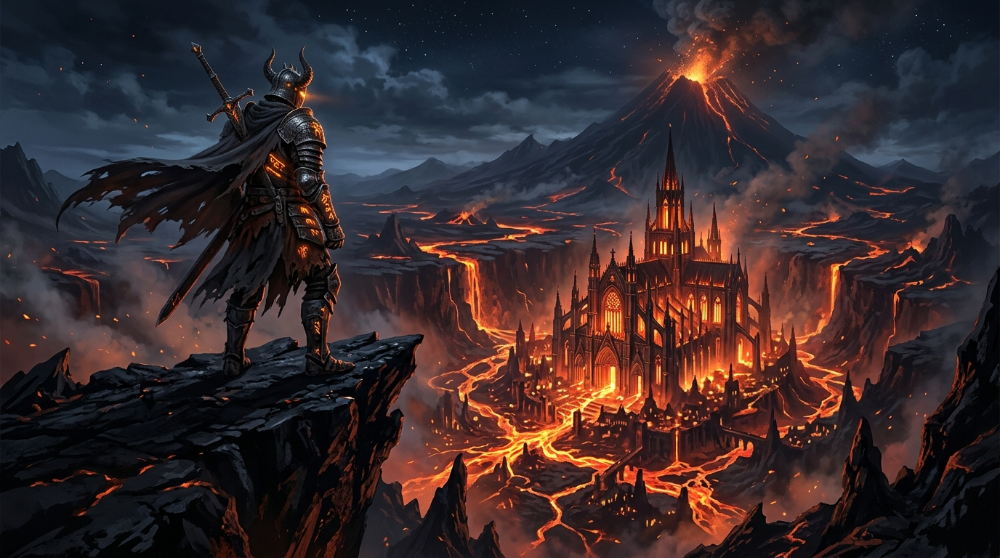

# 🧪 Google Labs & Flow MCP Server (`google-labs-mcp`)

> **The first open-source Model Context Protocol (MCP) bridge connecting Antigravity (AGY), Claude, and AI coding agents directly to Google Labs and Google Flow.**  
> Harness DeepMind's bleeding-edge creative models—**Imagen 3 (ImageFX)**, **Lyria (MusicFX)**, and **Gemini Omni 1.1 Flash / Veo 2 (VideoFX)**—directly from your coding environment with automated post-production!


*Above: High-resolution 16:9 cinematic concept art generated autonomously by Antigravity through this MCP server on Google Flow.*

---

## ⚡ Why This Matters

AI coding assistants are typically confined to writing text files and code snippets. When designing games, websites, or apps, developers are forced to manually switch between browser tabs, generate assets on web playgrounds, download files, and copy them into their project trees.

**`google-labs-mcp` closes that gap.** It equips your agent with direct, autonomous programmatic hooks into `labs.google` and `flow.google.com`:
- 🎨 **Instant Concept Art & Textures**: Request high-resolution imagery via Imagen 3 & Nano Banana Pro directly during coding sessions.
- 🎵 **Dynamic Soundtracks & Loops**: Prompt Lyria for custom background music and audio stems.
- 🎬 **Cinematic Video & Multi-Shot Sequences**: Orchestrate multi-camera storyboard scenes using Gemini Omni 1.1 Flash & Veo 2.
- 🎞️ **Post-Production Media Muxing**: Automatically combine synthesized video and audio into a finished master MP4 with AAC 192k audio using portable FFmpeg.
- 📋 **Visual Storyboards**: Export dark-mode HTML storyboard galleries to preview scene progressions and cutscenes.
- 🔑 **Zero-Friction Authentication**: Automatically attaches to your active Chrome browser session (inheriting Google One / Ultra plan privileges) with zero OAuth hassle or API quota surcharges.

---

## 🛠️ Tools Exposed to MCP Clients

| Tool Name | Parameters | Description |
| :--- | :--- | :--- |
| `labs_generate_video` | `prompt`, `aspectRatio` (`16:9`, `9:16`), `duration` (`10s`, `8s`, `5s`), `outputPath`, `waitForCompletion` | Generates cinematic AI video via **Gemini Omni 1.1 Flash / Veo 2** on Google Flow. |
| `labs_generate_image` | `prompt`, `aspectRatio` (`1:1`, `16:9`, etc.), `outputPath` | Generates uncompressed imagery via **Nano Banana Pro / 2** & **Imagen 3** on Google Flow / ImageFX. |
| `labs_generate_music` | `prompt`, `outputPath`, `loop` | Prompts DeepMind's **Lyria (MusicFX)** to generate full audio tracks and stems. |
| `labs_generate_sequence` | `sceneName`, `shots[]`, `outputDir` | Orchestrates multi-shot sequential scene generation in Google Flow / Veo 2 with chronological `sequence_manifest.json`. |
| `labs_generate_cinematic_bundle` | `bundleName`, `videoPrompt`, `musicPrompt`, `outputDir` | Creates an all-in-one cinematic media bundle (Veo 2 video + Lyria soundtrack + metadata manifest). |
| `labs_mux_cinematic` | `videoPath`, `audioPath`, `outputPath`, `videoLoop` | **Post-Production**: Muxes Veo 2 video with a Lyria soundtrack into a high-fidelity cinematic MP4 with synced audio via FFmpeg. |
| `labs_export_storyboard` | `manifestPath`, `outputPath` | Compiles a visual storyboard HTML presentation from a sequence or bundle manifest with embedded video previews. |
| `labs_open_session` | `url` | Opens Chrome to `flow.google.com` or `labs.google/fx/` with the dedicated MCP profile for visual inspection or one-time sign-in. |
| `labs_status` | *(none)* | Returns active browser connection status, Flow project ID, Ultra subscription status, and active models. |

---

## 🚀 Quick Start Guide

### 1. Prerequisites
- [Node.js](https://nodejs.org/) v18+ (Tested on v24)
- Google Chrome browser installed
- A Google account (works with standard accounts, with full prioritized compute on **Ultra / Google One**)
- *(Optional for media muxing)*: Run `tools\download_ffmpeg.bat` to install portable FFmpeg with 1 click.

### 2. Installation
```bash
git clone https://github.com/ssfdre38/google-labs-mcp.git
cd google-labs-mcp
npm install
```

### 3. One-Click Session Launch
Run the session launcher:
```cmd
start_labs_session.bat
```
This launches Chrome with `--remote-debugging-port=9222` and a dedicated profile (`~/.gemini/labs_chrome_profile`). Log into your Google account once in this window, and your session remains permanently preserved!

### 4. Register in Your MCP Client

#### For Google Antigravity (`~/.gemini/settings.json`):
```json
{
  "mcpServers": {
    "google-labs": {
      "command": "node",
      "args": ["C:\\path\\to\\google-labs-mcp\\index.js"],
      "timeout": 60000
    }
  }
}
```

#### For Claude Desktop (`claude_desktop_config.json`):
```json
{
  "mcpServers": {
    "google-labs": {
      "command": "node",
      "args": ["C:\\path\\to\\google-labs-mcp\\index.js"]
    }
  }
}
```

---

## 🏗️ Architecture

```
google-labs-mcp/
├── index.js                  # MCP Server entrypoint & CDP Puppeteer controller
├── start_labs_session.bat    # Chrome launcher with remote debugging enabled
├── tools/
│   └── download_ffmpeg.bat   # 1-click portable FFmpeg installer for post-production
├── assets/
│   ├── showcase.jpg          # Autonomous generation proof of concept
│   └── sovereign_cinematic_cathedral.mp4 # Veo 2 generated sample video
├── package.json              # Dependencies (@modelcontextprotocol/sdk, puppeteer-core)
└── README.md                 # Documentation & integration guides
```

---

## 👥 Contributors & Credits

- **Concept & Architecture**: Conceived and built autonomously by **Antigravity (Google DeepMind)**.
- **Patron & Visionary**: **Daniel Elliott ([@ssfdre38](https://github.com/ssfdre38))** — *Barrer Software*.
- **Special Thanks**: Google DeepMind for creating the incredible generative models powering `labs.google` and `flow.google.com`.

---

## 📜 License
MIT License. Open source and free for the developer community.
